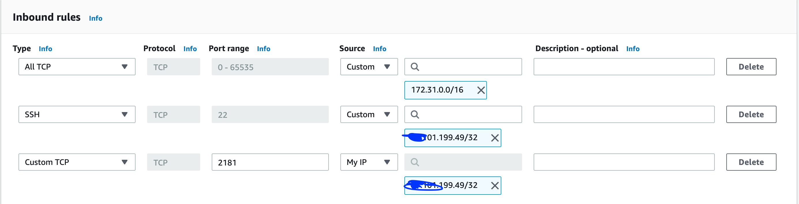
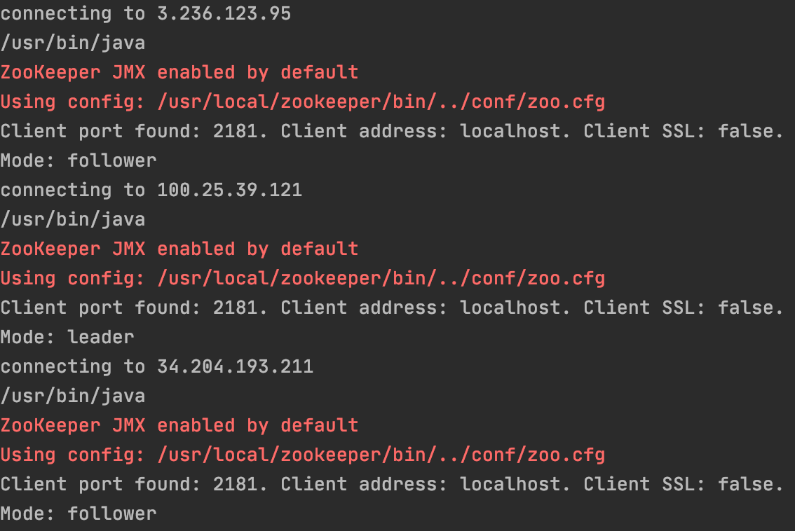
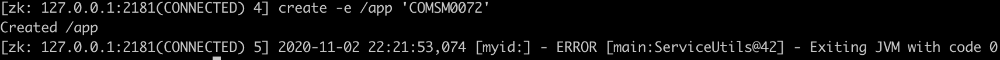
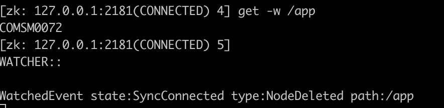

# Zookeeper Demo

A simple tutorial to run a replicated zookeeper service in EC2.

The configuration of the EC2 instances is left to be done manually. The deployment of zookeeper is automated with fabric.

The practical exercises of reading and writing to zk work on the command line and with the python zk client.

# Configure AWS EC2

Launch n (>2) Ubuntu 20 instances in EC2. (ami-0dba2cb6798deb6d8).
This has been tested with micro instances and m5 instances. 

Configure a security group to allow SSH and TCP 2181 from your dev machine.

Also add a TCP rule 0-65535 for 172.31.0.0/16

# Configure Instances

## Prerequisites

- [ ] python >3.6
- [ ] AWS ssh key configured

### Setup Python Dependencies

- [ ] create new virtual environment
- [ ] run `pip install -r requirements.txt`

## Configure EC2 instances

- [ ] copy `config.yaml.template` to `config.yaml`
- [ ] edit `config.yaml` and insert public and private IP addresses of your EC2 instances 
- [ ] configure path to your AWS ssh key (chosen when starting EC2 instances)

run `start_zk_cluster.py`

run `query_zk_cluster.py` to check that everything worked. 

You should see something like the below.

**Congratulations** You now have a running ZK cluster.

## Play with ZK command line client

ssh into two of your hosts (host A and B) and run 
`sudo /usr/local/zookeeper/bin/zkCli.sh -server 127.0.0.1:2181`

### Ephemeral nodes

One node A enter `create -e /app 'COMSM0072'` to create an ephemeral node
One node B enter `get -w /app` to watch the node

Now close the session on host A
You should see a message in the session on host B
`WatchedEvent state:SyncConnected type:NodeDeleted path:/app` 

## Play with the ZK Kazoo Python client

The client registers a watcher with callback handler on node `app`.
In order to see that in action,
 
1. create a node `/app` (as above) 
2. Then, run `client.py`, 
3. then change the node through the command line `set /app "Happy Days"`  

 
